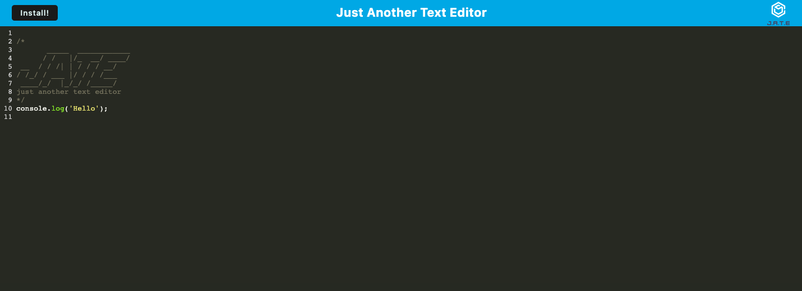
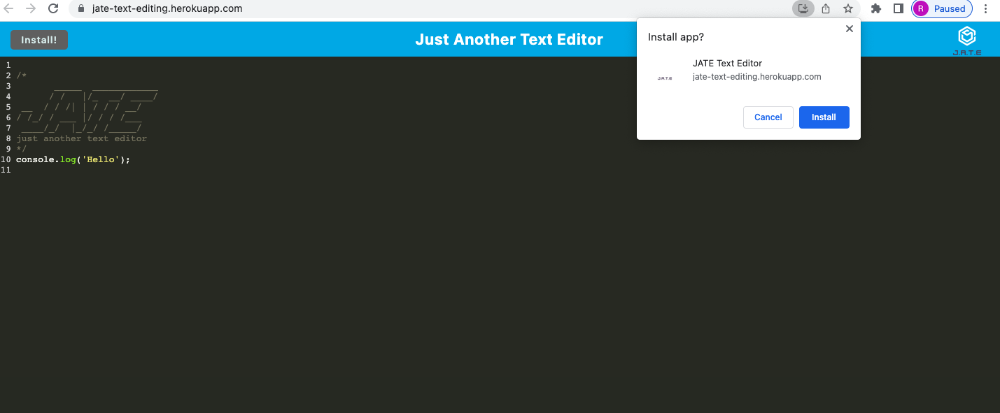
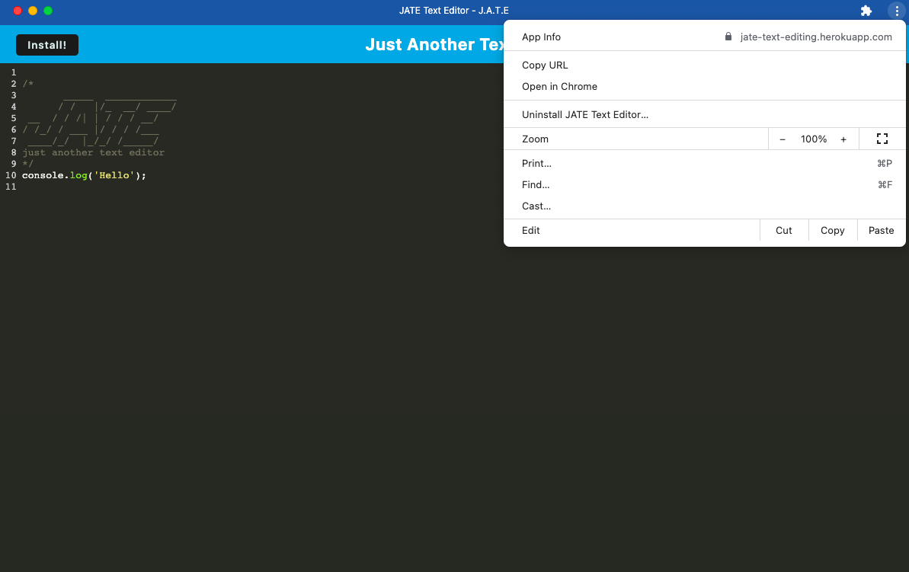

# J.A.T.E: Just Another Text Editor

  

  
  
  
  
  

  ## Description

The purpose of this project was to build a single-page application that meets Progressive Web Application criteria. This application allows the user to view and edit text offline and features JavaScript syntax highlighting. The user also has the option of installing the application on their desktop. While building this project, I became comfortable utilizing webpack plugins and IndexedDB storage.

  ## Usage

  To access this application, visit the following URL: [https://jate-text-editing.herokuapp.com/](https://jate-text-editing.herokuapp.com/). Click anywhere to start editing text!

  

 ## Installation

  To install as a desktop application, click on the "Install" button.

 

 To uninstall the desktop application, click on the menu in the top right corner and select "Uninstall JATE Text Editor".

 

  ## Credits

This project was based on the starter code from the cautious-meme repository belonging to the GitHub user @coding-boot-camp.

  ## License

  This application is covered under the MIT License.
  To view a description of this license type, refer to the repo or click [here](https://opensource.org/licenses/MIT).

  ## Contributing

  Ways to contribute include suggesting bug fixes.
  
  ## Tests

  N/A

  ## Questions

  If you have any questions or would like to provide feedback, do not hesitate to view my GitHub profile at [https://github.com/rpecuch](https://github.com/rpecuch) or contact me at rpecuch@comcast.net.